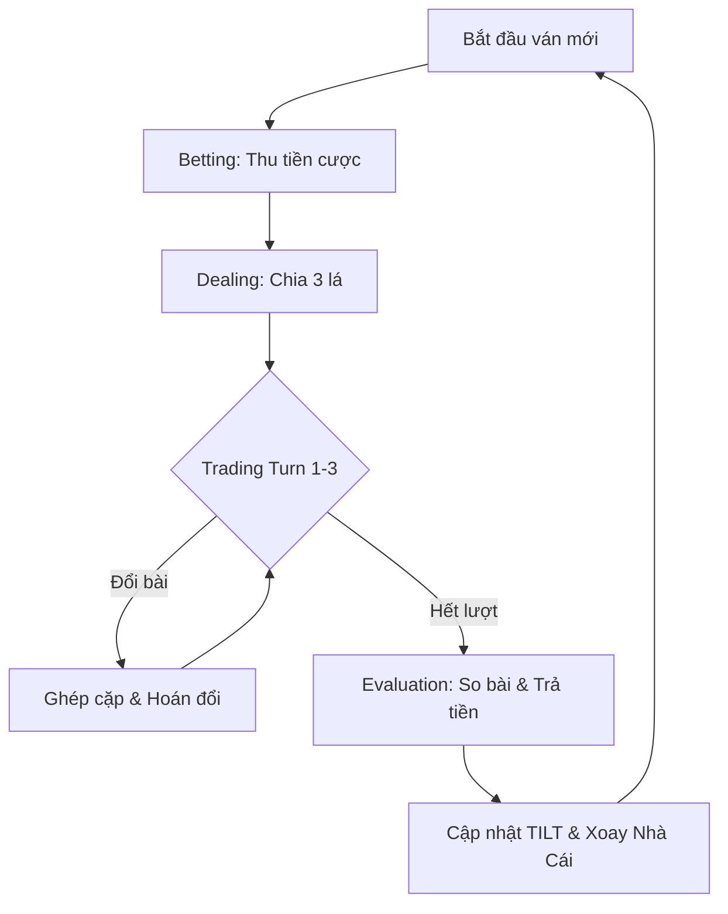

# LUỒNG VẬN HÀNH HỆ THỐNG (GAME FLOW)

Dự án sử dụng mô hình **State Machine (Máy trạng thái)** để quản lý vòng đời của một ván đấu. Hiểu luồng này giúp người sử dụng giải mã được trình tự dữ liệu xuất hiện trong các file log/database.

## 1. Các trạng thái chính (Game States)

Hệ thống lặp đi lặp lại qua 4 trạng thái cốt lõi:

### 1.1. Betting State (Đặt cược)
- Hệ thống trừ tiền cược (`Ante`) của tất cả Nhà Con.
- Xóa bài cũ trên tay người chơi.
- Làm mới bộ bài (Reset deck).
- Kiểm tra điều kiện loại biên: Người chơi hết tiền sẽ bị loại (`isEliminated`).

### 1.2. Dealing State (Chia bài)
- Chia lần lượt mỗi người 3 lá bài.
- Tính toán điểm số ban đầu và cập nhật bộ nhớ đệm (`cachedScore`).

### 1.3. Trading State (Trao đổi bài - Giai đoạn quan trọng nhất)
Đây là giai đoạn tạo ra nhiều dữ liệu nhất cho việc phân tích hành vi AI.
- Giai đoạn này gồm **3 lượt đổi bài** (Turns).
- **Mỗi lượt**:
  1. AI tính toán chỉ số thỏa mãn (`Satisfaction`) và thèm muốn (`Desire`).
  2. AI quyết định có muốn đổi bài hay không (`wantsToTrade`).
  3. Nếu có từ 2 người trở lên muốn đổi, hệ thống sẽ xáo trộn và ghép cặp ngẫu nhiên.
  4. Hai người trong cặp sẽ trao đổi 1 lá bài (thường là lá bài xấu nhất).
  5. Cập nhật lại điểm số ngay lập tức sau khi đổi.

### 1.4. Evaluation State (Quyết toán)
- Nhà Cái lật bài và so sánh với từng Nhà Con.
- Thực hiện chuyển tiền (Payout) dựa trên kết quả Thắng/Thua.
- Cập nhật trạng thái **TILT** của người chơi (nếu thua quá nhiều).
- **Xoay vòng Nhà Cái**: Người tiếp theo trong danh sách (còn tiền) sẽ làm Nhà Cái cho ván sau.

---

## 2. Luồng dữ liệu (Data Pipeline)

Trong quá trình vận hành, dữ liệu được ghi xuống liên tục:
1. **Trong Trading State**: Mỗi quyết định đổi bài (dù thành công hay không) đều được ghi vào bảng `swaps` hoặc file CSV tương ứng.
2. **Trong Evaluation State**: Kết quả tổng quát của ván đấu được ghi vào bảng `rounds`.
3. **Kết thúc ván**: Số dư tài khoản mới được cập nhật vào lịch sử (`bankroll_history`).

## 3. Sơ đồ mô phỏng (Logic Flow)

