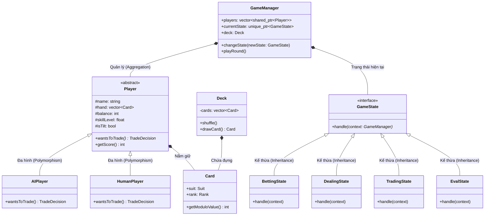

# KIẾN TRÚC HƯỚNG ĐỐI TƯỢNG (OOP ARCHITECTURE)

Tài liệu này giải thích cách hệ thống được xây dựng dựa trên các nguyên lý lập trình hướng đối tượng và các mẫu thiết kế (Design Patterns) để đảm bảo tính mở rộng và dễ bảo trì.

---

## 1. Sơ đồ lớp (Class Diagram)

Hệ thống được thiết kế theo mô hình phân lớp rõ ràng, tách biệt giữa dữ liệu (`Card`, `Deck`), thực thể (`Player`) và điều khiển (`GameManager`, `GameState`).

### 1.1. Chi tiết các thuộc tính chính (Key Attributes)

Để mô phỏng được tâm lý và hành vi phức tạp, các lớp được trang bị các thuộc tính đặc thù:

#### Lớp `Player` (Trừu tượng)
- `#skillLevel`: Quyết định khả năng tính toán lý trí.
- `#confidenceLevel`: Biến động dựa trên lịch sử thắng/thua, ảnh hưởng đến độ mạo hiểm.
- `#tradeDesire`: Biến tích lũy đại diện cho áp lực muốn đổi bài.
- `#hasStayed`: Cờ đánh dấu trạng thái "Dằn bài", khóa mọi hành động trading tiếp theo.
- `#isTilt`: Trạng thái "Cay cú" khi thua quá nhiều, làm thay đổi bộ tham số hành vi.

#### Lớp `GameManager`
- `+currentState`: Sử dụng **Smart Pointer** (`unique_ptr`) để quản lý vòng đời của trạng thái hiện tại.
- `+roundCount`: Đếm số ván bài để đồng bộ dữ liệu với SQL/CSV.
- `+simulationSeed`: Hạt giống gốc giúp tái lập toàn bộ kịch bản mô phỏng.
- `+archetypeConfigs`: Bản đồ (Map) lưu trữ các tham số đặc trưng cho từng loại cá tính AI.

#### Lớp `Card` & `Deck`
- `+suit` & `+rank`: Sử dụng `enum class` để đảm bảo tính an toàn kiểu dữ liệu (Type Safety).
- `-cards`: Vector chứa 52 đối tượng Card, được xáo trộn bằng thuật toán `std::shuffle`.

---

## 2. Các mẫu thiết kế (Design Patterns)

### 2.1. State Pattern (Mẫu trạng thái)
Đây là "xương sống" của hệ thống. Thay vì sử dụng các câu lệnh `if-else` hoặc `switch-case` khổng lồ để kiểm tra xem game đang ở giai đoạn nào, chúng ta tách mỗi giai đoạn thành một lớp riêng biệt kế thừa từ `GameState`.

- **Ưu điểm**: 
    - Tuân thủ nguyên lý **Open/Closed**: Dễ dàng thêm luật chơi mới (ví dụ: vòng cược bổ sung) bằng cách thêm một State mới mà không sửa code cũ.
    - Logic của từng pha được đóng gói gọn gàng, dễ debug.

### 2.2. Strategy Pattern & Polymorphism (Chiến lược & Đa hình)
Hành vi của người chơi (đặc biệt là logic đổi bài) được thực hiện thông qua cơ chế **Virtual Methods**. 

- `Player` là một lớp trừu tượng (Abstract Class).
- `AIPlayer` triển khai logic dựa trên hàm Sigmoid.
- `HumanPlayer` triển khai logic dựa trên nhập liệu từ bàn phím.
- **Tính đa hình**: `GameManager` gọi `player->wantsToTrade()` mà không cần biết đó là người hay máy.

---

## 3. Quản lý bộ nhớ & Tính an toàn (Memory Management)

Hệ thống sử dụng **Smart Pointers** (C++11/17) để loại bỏ hoàn toàn lỗi rò rỉ bộ nhớ (Memory Leaks):

*   `std::shared_ptr<Player>`: Cho phép nhiều thành phần (Manager, States) cùng tham chiếu đến một người chơi mà vẫn tự động giải phóng khi không còn ai dùng.
*   `std::unique_ptr<GameState>`: Đảm bảo tại một thời điểm chỉ có một trạng thái duy nhất tồn tại và được quản lý vòng đời bởi `GameManager`.

---

## 4. Encapsulation (Tính đóng gói)

- Các thuộc tính nhạy cảm như `balance`, `skillLevel` được để ở mức `protected` hoặc `private`.
- Chỉ các lớp "bạn bè" (`friend class`) như các `State` mới có quyền can thiệp sâu vào dữ liệu người chơi, đảm bảo tính toàn vẹn của dữ liệu trong suốt quá trình mô phỏng.
