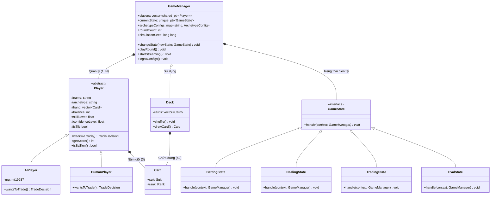

# KIẾN TRÚC HƯỚNG ĐỐI TƯỢNG (OOP ARCHITECTURE)

Tài liệu này giải thích cách hệ thống được xây dựng dựa trên các nguyên lý OOP để đảm bảo tính **Mở rộng (Extensibility)** và **Linh hoạt (Flexibility)**.

---

## 1. Sơ đồ lớp (Class Diagram) - Phiên bản chuẩn hóa

---

## 2. Các điểm cải tiến về Thiết kế (Design Highlights)

### 2.1. Dynamic Archetype System (Cơ chế Archetype Động)
Thay vì sử dụng `enum` cứng nhắc, hệ thống sử dụng **`std::string`** làm định danh cho các loại cá tính AI. 
- **Lợi ích**: Người dùng có thể thêm bất kỳ loại AI mới nào vào file `config.ini` (ví dụ: `[WHALE]`, `[GAMBLER]`) mà không cần sửa đổi mã nguồn.
- **Kỹ thuật**: Sử dụng `std::map<std::string, ArchetypeConfig>` để lưu trữ tham số cấu hình.

### 2.2. State Pattern (Mẫu trạng thái)
Vòng đời của một ván bài được tách bạch thành các lớp `State` riêng biệt. Điều này giúp loại bỏ các cấu trúc `if-else` phức tạp trong `GameManager` và cho phép mở rộng luật chơi (ví dụ: thêm vòng cược) cực kỳ dễ dàng.

### 2.3. Polymorphism & Smart Pointers
- Sử dụng `std::shared_ptr<Player>` để quản lý đa hình giữa Người và Máy.
- `std::unique_ptr<GameState>` đảm bảo quản lý bộ nhớ an toàn, tự động giải phóng trạng thái cũ khi chuyển sang trạng thái mới.

---

## 3. Quản lý Dữ liệu (Data Streaming)
Dữ liệu được đẩy trực tiếp ra các tệp CSV thông qua các luồng (`std::ofstream`) được quản lý bởi `GameManager`. Việc gỡ bỏ SQLite giúp hệ thống nhẹ hơn và loại bỏ các phụ thuộc thư viện bên ngoài (External Dependencies), tăng tính di động (Portability) của phần mềm.
