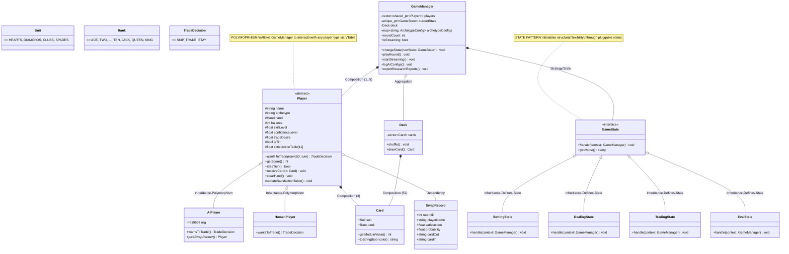
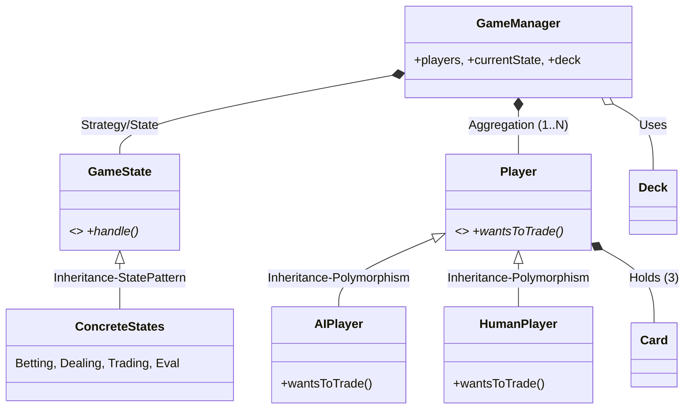

# KIẾN TRÚC HƯỚNG ĐỐI TƯỢNG CHUYÊN SÂU (ADVANCED OOP ARCHITECTURE)

Tài liệu này cung cấp cái nhìn chi tiết về cách áp dụng các nguyên lý OOP nâng cao và các mẫu thiết kế (Design Patterns) để xây dựng hệ thống mô phỏng Bài Cào Cái bền vững, dễ mở rộng.

---

## 1. Sơ đồ lớp Toàn diện (Comprehensive Class Diagram)

---

## 2. Phân tích các Nguyên lý OOP áp dụng

### 2.1. Tính Trừu tượng (Abstraction)
Hệ thống không làm việc trực tiếp với các hành vi cụ thể mà làm việc thông qua các lớp cơ sở trừu tượng (`Player`, `GameState`).
- **Ví dụ**: `GameManager` chỉ biết nó đang giữ một danh sách `Player*`. Khi cần đổi bài, nó chỉ gọi `wantsToTrade()`. Việc đó là do con người nhập hay do thuật toán Sigmoid tính toán thì `GameManager` không cần biết.

### 2.2. Tính Đa hình (Polymorphism)
Đây là chìa khóa để tạo ra các loại AI khác nhau.
- **Liên kết động (Dynamic Binding)**: Tại thời điểm chạy, C++ sẽ dựa vào **VTable** để quyết định hàm `wantsToTrade()` nào được gọi.
- **Tính mở rộng**: Để thêm một loại người chơi mới (ví dụ: `NeuralNetPlayer`), ta chỉ cần tạo lớp kế thừa từ `Player` mà không phải sửa một dòng code nào trong `GameManager`.

### 2.3. Quản lý Bộ nhớ An toàn (Modern C++)
Dự án sử dụng triệt để Smart Pointers (C++11/17) để ngăn chặn Memory Leaks:
- **`std::shared_ptr<Player>`**: Vì một Player có thể được tham chiếu bởi `GameManager` và các `State` khác nhau cùng lúc.
- **`std::unique_ptr<GameState>`**: Đảm bảo tại một thời điểm chỉ có duy nhất một trạng thái trò chơi tồn tại. Khi chuyển trạng thái, trạng thái cũ sẽ tự động được giải phóng một cách an toàn.

---

## 3. Các mẫu thiết kế (Design Patterns) chuyên sâu

### 3.1. State Pattern (Mẫu Trạng thái)
Thay vì dùng một hàm `main` khổng lồ với hàng chục biến cờ (`isDealing`, `isTrading`), chúng ta đóng gói mỗi giai đoạn thành một đối tượng.
- **Quy trình chuyển đổi**: `Betting` -> `Dealing` -> `Trading` -> `Eval` -> (Lặp lại).
- **Lợi ích**: Logic của mỗi giai đoạn được cô lập. Nếu muốn sửa cách chia bài, bạn chỉ cần sửa trong `DealingState` mà không sợ làm hỏng logic tính điểm trong `EvalState`.

### 3.2. Dynamic Configuration (Cấu hình Động)
Hệ thống sử dụng mẫu gần giống với **Prototype/Registry** cho các Archetype.
- Thay vì dùng `enum` cố định, chúng ta dùng `std::map<std::string, ArchetypeConfig>`.
- Khi khởi tạo AI, hệ thống sẽ "đăng ký" các tham số từ file `config.ini` vào map này. Điều này biến mã nguồn thành một "Engine" thực thụ, có thể thay đổi toàn bộ hành vi của quần thể AI mà không cần biên dịch lại.

---

## 4. Cơ chế Xử lý Luồng Dữ liệu (Data Flow)

Hệ thống áp dụng cơ chế **Observer-like Logging**:
1.  **Sự kiện**: Một hành động xảy ra (ví dụ: AI quyết định đổi bài).
2.  **Đóng gói**: Thông tin được đóng gói vào struct `SwapRecord`.
3.  **Ghi nhận**: `GameManager` kiểm tra nếu `isStreaming == true` thì sẽ đẩy dữ liệu này vào luồng `std::ofstream` tương ứng.
4.  **Đảm bảo**: Sử dụng lệnh `.flush()` định kỳ để đảm bảo dữ liệu không bị mất nếu chương trình gặp sự cố đột ngột.

---

## 6. Minh chứng Kế thừa và Đa hình (Inheritance & Polymorphism Evidence)

Đây là các điểm then chốt để trả lời giảng viên về cách hệ thống áp dụng các đặc tính lõi của OOP:

### 6.1. Kế thừa (Inheritance)
- **Cấu trúc**: `AIPlayer` và `HumanPlayer` kế thừa từ lớp cơ sở `Player`. `BettingState`, `DealingState`,... kế thừa từ `GameState`.
- **Lợi ích**: Tái sử dụng mã nguồn (Code Reuse). Các thuộc tính chung như `balance`, `name`, `hand` chỉ cần định nghĩa một lần ở lớp cha `Player`.

### 6.2. Đa hình (Polymorphism) - Kết quả của Kế thừa
- **Cơ chế**: Sử dụng **Hàm thuần ảo (Pure Virtual Functions)**.
    - `virtual TradeDecision wantsToTrade(...) = 0;` trong lớp `Player`.
    - `virtual void handle(GameManager* context) = 0;` trong lớp `GameState`.
- **Mối quan hệ nhân quả**: Trong sơ đồ, nhãn `Inheritance-Polymorphism` thể hiện rằng **Kế thừa là nền tảng để đạt được Đa hình**. 
    - Nếu không có Kế thừa, `GameManager` không thể quản lý các đối tượng khác nhau trong cùng một danh sách.
    - Nếu không có Đa hình, việc kế thừa chỉ là sao chép thuộc tính, không thể thay đổi chiến thuật linh hoạt.
- **Đa hình tại thời điểm chạy (Runtime Polymorphism)**: 
    - Khi `GameManager` gọi `players[i]->wantsToTrade()`, chương trình sẽ tự động tìm đến đúng hàm của `AIPlayer` (nếu là máy) hoặc `HumanPlayer` (nếu là người) thông qua **VTable**. 
    - Điều này giúp hệ thống xử lý hàng nghìn người chơi với các thuật toán khác nhau mà không cần sửa đổi mã nguồn điều khiển chính.

### 6.4. Phân tích Cấu trúc (Structural Deep Dive)

Trong thiết kế này, Kế thừa và Đa hình không chỉ là kỹ thuật lập trình mà là **xương sống của toàn bộ cấu trúc hệ thống**:

1.  **Kế thừa là định nghĩa "Hợp đồng" (Contractual Inheritance)**:
    - Khi `AIPlayer` kế thừa `Player`, nó "cam kết" phải có các thuộc tính và hành vi mà một người chơi cần có. Điều này giúp cấu trúc của `GameManager` trở nên ổn định. Manager không cần quan tâm AI đó thông minh hay ngu ngốc, nó chỉ cần biết AI đó "tuân thủ hợp đồng" của lớp `Player`.

2.  **Đa hình là cơ chế "Cắm rút" (Pluggable Architecture)**:
    - Nhờ đa hình, các `State` (Trạng thái) có thể được thay thế cho nhau tại thời điểm chạy. 
    - **Cấu trúc linh hoạt**: `GameManager` giống như một cái ổ cắm, và các `State` là các thiết bị điện khác nhau (Quạt, Đèn, Tivi). Dù bạn cắm thiết bị nào vào, ổ cắm vẫn hoạt động theo đúng quy trình. Điều này cho phép hệ thống chuyển đổi từ "Chia bài" sang "Đổi bài" chỉ bằng cách thay đổi đối tượng mà con trỏ `currentState` đang trỏ tới.

3.  **Sự kết hợp hoàn hảo**:
    - **Kế thừa** tạo ra sự phân cấp (Hierarchy).
    - **Đa hình** cho phép sự linh động (Flexibility) trong phân cấp đó.
    - Kết quả là một hệ thống **Loose Coupling** (Ghép nối lỏng): Các thành phần phụ thuộc vào các giao diện trừu tượng thay vì phụ thuộc vào các lớp cụ thể.

---

## 7. Sơ đồ Rút gọn cho Thuyết trình (Simplified Presentation Diagram)

Dưới đây là phiên bản lược bỏ các chi tiết thuộc tính, tập trung vào mối quan hệ **Kế thừa (Inheritance)** và **Đa hình (Polymorphism)**, rất phù hợp để đưa vào Slide thuyết trình.

## 8. Kết luận về Kiến trúc
Kiến trúc này đạt được sự cân bằng giữa **Hiệu năng (C++ thuần)** và **Khả năng Bảo trì (OOP)**. Nó không chỉ là một trò chơi, mà là một khung sườn (Framework) có khả năng mô phỏng bất kỳ kịch bản cá cược đa tác nhân (Multi-agent) nào.

